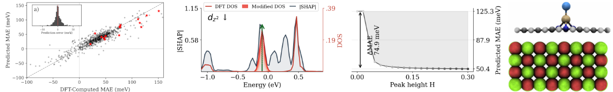

# ml-dos2mae

Code and data for the paper:

**Can end-to-end learning from raw electronic structure explain magnetic anisotropy?**

*Rafał Topolnicki, Jan Navrátil, Piotr Błoński*




---
## Installation

Clone the repository and install the dependencies:

```bash
git clone git@github.com:RafalTopolnicki/ml-dos2mae.git
cd ml-dos2mae
conda create -n ml-dos2mae python=3.9
conda activate ml-dos2mae
conda install pytorch -c pytorch
pip install -r requirements.txt
```
---

## Repository structure

```
DATA/               - database CSV files and per-system SR-DOSCAR files
src/                - model, data loading, training, and evaluation modules
main.py             - training entry point
evaluate.py         - evaluation and inference entry point
run_experiments.sh              - cross-validation training for all models
run_experiments_trainonwhole.sh - train-on-whole models (for SHAP and OOD inference)
```
---

## Dataset

The `DATA/` directory contains the full dataset required to train the models
and reproduce all results reported in the paper.

| File / folder | Description |
|---|---|
| `database.csv` | Main index: 806 TM dimer systems with DFT-computed targets (MAE, ESOC, HSOCd) and metadata |
| `explicit_database.csv` | 15 explicit-substrate systems used for out-of-distribution evaluation |
| `{path}/*_SR_DOSCAR_{atomID}` | Scalar-relativistic DOSCAR files (one per TM atom per system) in VASP format |
| `ExplicitSubsrates/{id}_POSCAR` | POSCAR structure files for the 15 explicit-substrate systems |

The DOSCAR files provide the spin- and orbital-resolved density of states
that serves as the sole input to both neural network architectures.
A POSCAR structure file is included for each system to enable visualization
of the atomic geometry.
All DFT calculations were performed with VASP using scalar-relativistic
settings; the corresponding non-collinear (fully relativistic) MAE targets
are stored in `database.csv`.

---

## Running experiments

### 1. Cross-validation

```bash
bash run_experiments.sh
```

Trains BiGRU and 1D-CNN models for all target configurations
(`MAE`, `MAE+ESOC`, `MAE+ESOC+HSOCd`) and both orbital representations
(`allorbitals`, `dorbitals`) using 8-fold cross-validation.

### 2. Train-on-whole models

```bash
bash run_experiments_trainonwhole.sh
```

Retrains each model on the full dataset without a held-out split.
The number of training epochs is set to the mean early-stopping epoch
from the corresponding cross-validation run.
These models are used for SHAP attribution analysis and out-of-distribution
(OOD) inference only — their in-domain performance is not reported.

### 3. Out-of-distribution inference

```bash
bash run_inference_ood.sh
```

Runs inference on the 15 explicit-substrate systems (`DATA/explicit_database.csv`)
using the train-on-whole models. Must be run after step 2.
Results are written to `eval_explicit.json` inside each model's
`experiments/{target}/{name}_train_on_whole/fold_0/` directory.

---

## Outputs

Results are written to `experiments/{target}/{timestamp}_{name}/`.
Each fold subdirectory contains:

| File | Description |
|---|---|
| `best_model.pth` | Saved model checkpoint (lowest validation loss) |
| `scaler.pickle` | StandardScaler fitted on training targets |
| `eval_test.json` | Metrics (R², MAE, RMSE) on the held-out test fold |
| `eval_val.json` | Metrics on the validation set |
| `eval_train.json` | Metrics on the training set |
| `loss_history.json` | Per-epoch train and validation loss |
| `arguments.json` | Full record of all hyperparameters used |

The fold-averaged test metrics are saved to `folds_summary.json` in the
experiment directory.

---

## Provided models

Pre-trained models are provided for all configurations listed below.
R² (MAE) is the 8-fold cross-validation average on the held-out test folds;
train-on-whole models have no held-out set and no R² is reported.

| Experiment | Architecture | Orbitals | Target | Training | R² (MAE) |
|---|---|---|---|---|---|
| [2026-07-28-002505_rnn_allorbitals](experiments/mae/2026-07-28-002505_rnn_allorbitals) | BiGRU | spd | MAE | 8-fold CV | 0.804 |
| [2026-07-28-004158_rnn_dorbitals](experiments/mae/2026-07-28-004158_rnn_dorbitals) | BiGRU | d | MAE | 8-fold CV | 0.786 |
| [2026-07-28-005803_cnn_allorbitals](experiments/mae/2026-07-28-005803_cnn_allorbitals) | 1D-CNN | spd | MAE | 8-fold CV | 0.808 |
| [2026-07-28-010421_cnn_dorbitals](experiments/mae/2026-07-28-010421_cnn_dorbitals) | 1D-CNN | d | MAE | 8-fold CV | 0.801 |
| [2026-07-28-030759_rnn_allorbitals_train_on_whole](experiments/mae/2026-07-28-030759_rnn_allorbitals_train_on_whole) | BiGRU | spd | MAE | train on whole | -- |
| [2026-07-28-031155_rnn_dorbitals_train_on_whole](experiments/mae/2026-07-28-031155_rnn_dorbitals_train_on_whole) | BiGRU | d | MAE | train on whole | -- |
| [2026-07-28-031539_cnn_allorbitals_train_on_whole](experiments/mae/2026-07-28-031539_cnn_allorbitals_train_on_whole) | 1D-CNN | spd | MAE | train on whole | -- |
| [2026-07-28-031721_cnn_dorbitals_train_on_whole](experiments/mae/2026-07-28-031721_cnn_dorbitals_train_on_whole) | 1D-CNN | d | MAE | train on whole | -- |
| [2026-07-28-010847_rnn_allorbitals](experiments/mae+esoc/2026-07-28-010847_rnn_allorbitals) | BiGRU | spd | MAE+ESOC | 8-fold CV | 0.821 |
| [2026-07-28-013100_rnn_dorbitals](experiments/mae+esoc/2026-07-28-013100_rnn_dorbitals) | BiGRU | d | MAE+ESOC | 8-fold CV | 0.817 |
| [2026-07-28-014947_cnn_allorbitals](experiments/mae+esoc/2026-07-28-014947_cnn_allorbitals) | 1D-CNN | spd | MAE+ESOC | 8-fold CV | 0.842 |
| [2026-07-28-015839_cnn_dorbitals](experiments/mae+esoc/2026-07-28-015839_cnn_dorbitals) | 1D-CNN | d | MAE+ESOC | 8-fold CV | 0.821 |
| [2026-07-28-031834_rnn_allorbitals_train_on_whole](experiments/mae+esoc/2026-07-28-031834_rnn_allorbitals_train_on_whole) | BiGRU | spd | MAE+ESOC | train on whole | -- |
| [2026-07-28-032342_rnn_dorbitals_train_on_whole](experiments/mae+esoc/2026-07-28-032342_rnn_dorbitals_train_on_whole) | BiGRU | d | MAE+ESOC | train on whole | -- |
| [2026-07-28-032801_cnn_allorbitals_train_on_whole](experiments/mae+esoc/2026-07-28-032801_cnn_allorbitals_train_on_whole) | 1D-CNN | spd | MAE+ESOC | train on whole | -- |
| [2026-07-28-033018_cnn_dorbitals_train_on_whole](experiments/mae+esoc/2026-07-28-033018_cnn_dorbitals_train_on_whole) | 1D-CNN | d | MAE+ESOC | train on whole | -- |
| [2026-07-28-020703_rnn_allorbitals](experiments/mae+esoc+dorbitals/2026-07-28-020703_rnn_allorbitals) | BiGRU | spd | MAE+ESOC+HSOCd | 8-fold CV | 0.796 |
| [2026-07-28-022732_rnn_dorbitals](experiments/mae+esoc+dorbitals/2026-07-28-022732_rnn_dorbitals) | BiGRU | d | MAE+ESOC+HSOCd | 8-fold CV | 0.786 |
| [2026-07-28-024738_cnn_allorbitals](experiments/mae+esoc+dorbitals/2026-07-28-024738_cnn_allorbitals) | 1D-CNN | spd | MAE+ESOC+HSOCd | 8-fold CV | 0.804 |
| [2026-07-28-025909_cnn_dorbitals](experiments/mae+esoc+dorbitals/2026-07-28-025909_cnn_dorbitals) | 1D-CNN | d | MAE+ESOC+HSOCd | 8-fold CV | 0.790 |
| [2026-07-28-033224_rnn_allorbitals_train_on_whole](experiments/mae+esoc+dorbitals/2026-07-28-033224_rnn_allorbitals_train_on_whole) | BiGRU | spd | MAE+ESOC+HSOCd | train on whole | -- |
| [2026-07-28-033711_rnn_dorbitals_train_on_whole](experiments/mae+esoc+dorbitals/2026-07-28-033711_rnn_dorbitals_train_on_whole) | BiGRU | d | MAE+ESOC+HSOCd | train on whole | -- |
| [2026-07-28-034149_cnn_allorbitals_train_on_whole](experiments/mae+esoc+dorbitals/2026-07-28-034149_cnn_allorbitals_train_on_whole) | 1D-CNN | spd | MAE+ESOC+HSOCd | train on whole | -- |
| [2026-07-28-034449_cnn_dorbitals_train_on_whole](experiments/mae+esoc+dorbitals/2026-07-28-034449_cnn_dorbitals_train_on_whole) | 1D-CNN | d | MAE+ESOC+HSOCd | train on whole | -- |

